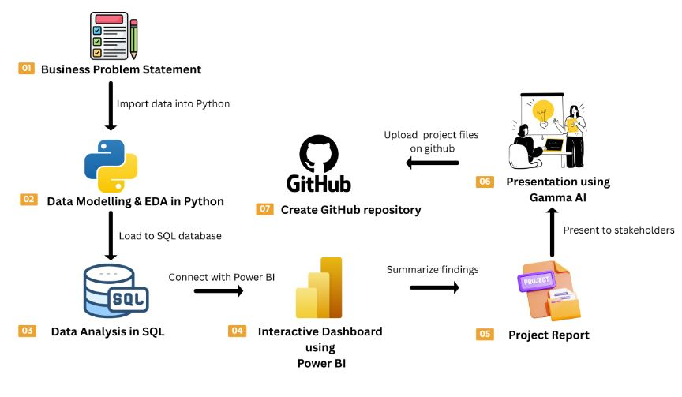

## Sales Insights Data Analysis Project(4month)

### Instructions to setup PostgreSQL on your local computer

1. Follow step in this video to install PostgreSQL on your local computer
https://youtu.be/4qH-7w5LZsA?si=LrutKiWn7Cvodakd

## 📌 Project Overview
The goal of this project is to simulate a corporate-grade end-to-end data analytics workflow, demonstrating the ability to translate raw data into strategic business intelligence by:

✅ Data Preparation,Modeling & Exploratory Data Analysis (Python): Clean and transform the raw dataset for analysis.

✅ Data Analysis (SQL): Simulate business transactions, and run queries to extract insights on customer segments, loyalty, and purchase drivers.

✅ Visualization & Insights (Power BI): Build an interactive dashboard that highlights key patterns and trends, enabling stakeholders to make data-driven decisions.

✅ Report and Presentation: Write a clear project report summarizing your key findings and business recommendations. Prepare a presentation that visually communicates insights and actionable recommendations to stakeholders.

## 🛠️ How to Use This Project
1. Clone the repository
   

